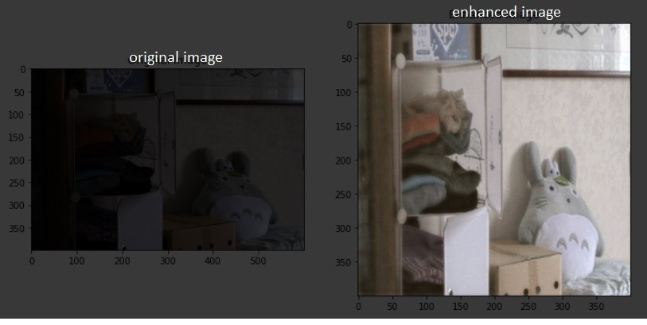

# Mirnet-TFLite

 - This Repo contains the TensorFlow Lite model conversion and inference processes for the **MIRNet** model as proposed by [Learning Enriched Features for Real Image Restoration and Enhancement](https://arxiv.org/pdf/2003.06792v2.pdf). 

 - This model is capable of enhancing low-light images upto a great extent. 
 
 
 
 # Note 
 
  - This model was quantized using dynamic range quantization as described [here](https://www.tensorflow.org/lite/performance/post_training_quant).
  
         Trained TFLite model are :
         
          > mirnet_dr.tflite(Model size is 36.567963 MBs) [Click Here](https://drive.google.com/file/d/1jGSzgS9YP7q9saycZR6PMkF6qDXHWh_6/view?usp=sharing) to download this model
          
          > mirnet_fp16.tflite(Model size is 70.008408 MBs.)
          
          > mirnet_int8.tflite(Model size is 37.283340 MBs.)
          
  - This model takes fixed-shaped **(400x400)** inputs (images with RGB channel).
  - This model is populated with metadata.

# Contributions

Those who are intrested to make an app for this are welcome (Preferably Flutter[ _ ](https://medium.com/flutterdevs/implementing-tensorflow-lite-in-flutter-c21738e9d35c) Developers)

Reach out to me [here](http://adhilcodes.me/)
